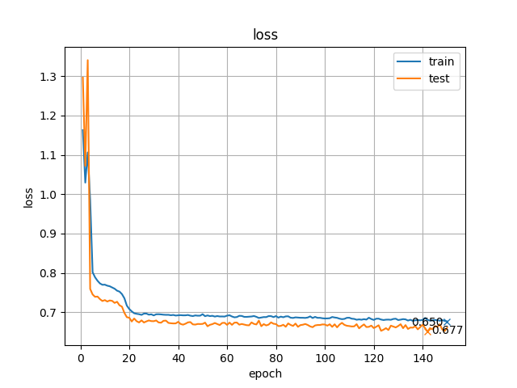
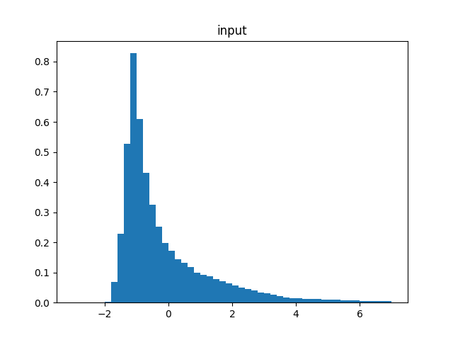
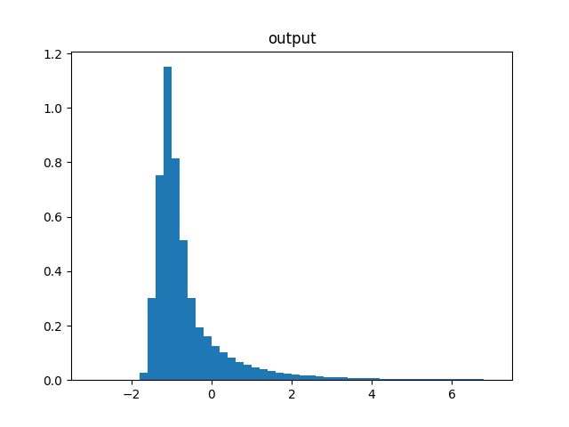
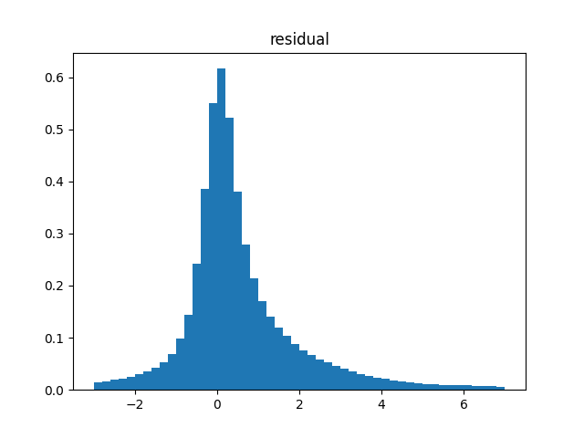

# U-Net LiDAR Compression

This application is to train and evaluate U-Net for LiDAR point cloud compression.

This application takes LiDAR point cloud packet data as input and return compression rates.

This program is based on "[Real-Time Streaming Point Cloud Compression for 3D LiDAR Sensor Using U-Net" by Chenxi Tu, Eijiro Takeuchi, Alexander Carballo, and Kazuya Takeda (IEEE Access 2019)](https://ieeexplore.ieee.org/document/8798629), and implemented by using `PyTorch`.

## Environment

- CUDA==10.0
- Python==3.8.5
- matplotlib==3.4.3
- numpy==1.21.2
- Pillow==8.3.2
- pillow-jpls==1.0.0
- PyYAML==5.4.1
- torch==1.4.0
- torchsummary==1.5.1
- torchvision==0.5.0
- tqdm==4.61.2

The versions of `torch` and `torchvision` should be compatible with the cuda version that you are using.

## Preparation

1. Clone this Repository

```bash
$ git clone https://github.com/hashi0203/unet-lidar-compression.git
```

2. Construct the enviroment

```bash
$ cd unet-lidar-compression
$ pip install -r requirements.txt
```

3. Download dataset

    We used the [dataset published in the original paper](https://drive.google.com/drive/u/0/folders/1qUG_kEqfoT3oCOIMHI0FOktY8Nk9hC3b).

    However, `.bag` files are not easy for us to use, so we convert them to `.txt` files.

    You can download the zip file from [this link (877 M)](https://projects.n-hassy.info/storage/unet-lidar-compression/data.zip).

    After downloading the dataset, unzip all data and place them as shown below.

    ```bash
    |-- unet-lidar-compression
        |-- data
            |-- 64S2.yaml
            |-- parking-lot.txt
            |-- ReadMe.txt
            |-- residential-area.txt
            |-- urban-road.txt
    ```

4. Download pre-trained model (if necessary)

    You can download the pre-trained model from [this link (152M)](https://projects.n-hassy.info/storage/unet-lidar-compression/ckpt-0917-1401.pth).

    After downloading the model, place them under `unet-lidar-compression/checkpoint`.

    ```bash
    $ cd unet-lidar-compression
    $ mkdir checkpoint
    $ mv ckpt-0917-1401.pth checkpoint/
    ```

5. Edit settings in `src/config.py` (if necessary)

    The variables `mu` and `theta` are mean and standard deviation of 100 frames randomly sampled from dataset.

    To get these values, run the following commands.

    ```bash
    $ cd unet-lidar-compression/src
    $ python3 param.py
    ```

## Train

```bash
$ cd unet-lidar-compression/src
$ python3 train.py
```

### Options

-- `--progress`, `-p`: show progress bar when preparing dataset
-- `--refresh`, `-r`: refresh dataset files to update (if not set, the saved intermediate outputs are reused to save time)
-- `--summary`, `-s`: show `torchsummary` to see the neural net structure

## Compression

```bash
$ cd unet-lidar-compression/src
$ python3 compress.py
```

Output histograms are saved in `graph` directory.

## Result

### Learning Curve



### Histogram

 

 

- `input`: input I frames
- `target`: input B frames
- `output`: predicted B frames
- `residual`: abs(`target` - `output`)

### Compression

```bash
Movie 0:
	mean: (input, residual) = (1.320, 1.280)
	I frames bytes           : 10282188
	B frames bytes (original): 32882813
	B frames bytes (output)  : 33546683
	output / original        : 1.015
	bytes per pixel          : 0.546
Movie 1:
	mean: (input, residual) = (1.690, 1.906)
	I frames bytes           : 10439953
	B frames bytes (original): 33471958
	B frames bytes (output)  : 34328764
	output / original        : 1.020
	bytes per pixel          : 0.561
Movie 2:
	mean: (input, residual) = (1.198, 0.935)
	I frames bytes           : 9787259
	B frames bytes (original): 31263362
	B frames bytes (output)  : 32278525
	output / original        : 1.025
	bytes per pixel          : 0.527
```

Actually, **the output is larger than the original**...

We must fix something, but we cannot figure out what to do...


## Reference

```
@ARTICLE{8798629,
  author={Tu, Chenxi and Takeuchi, Eijiro and Carballo, Alexander and Takeda, Kazuya},
  journal={IEEE Access},
  title={Real-Time Streaming Point Cloud Compression for 3D LiDAR Sensor Using U-Net},
  year={2019},
  volume={7},
  number={},
  pages={113616-113625},
  doi={10.1109/ACCESS.2019.2935253}
}
```